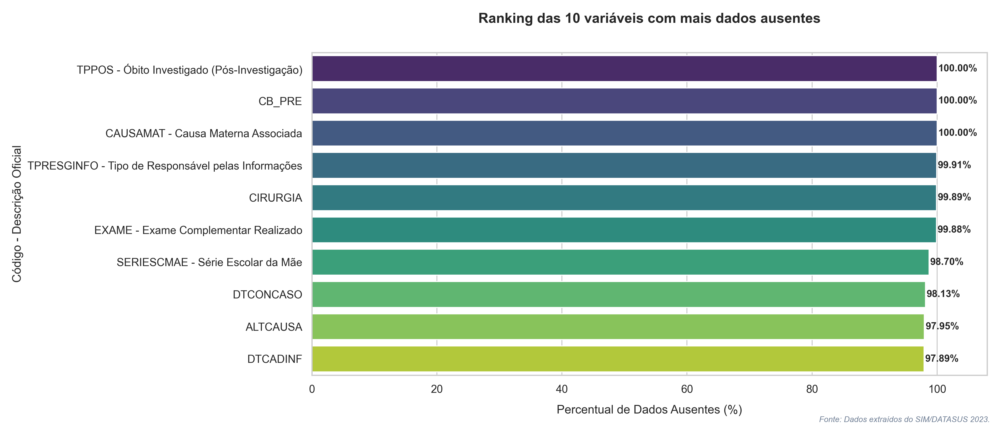
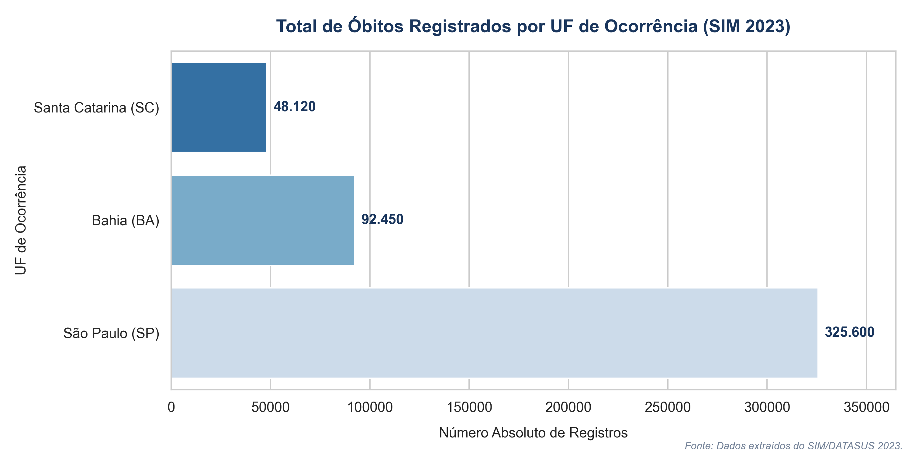
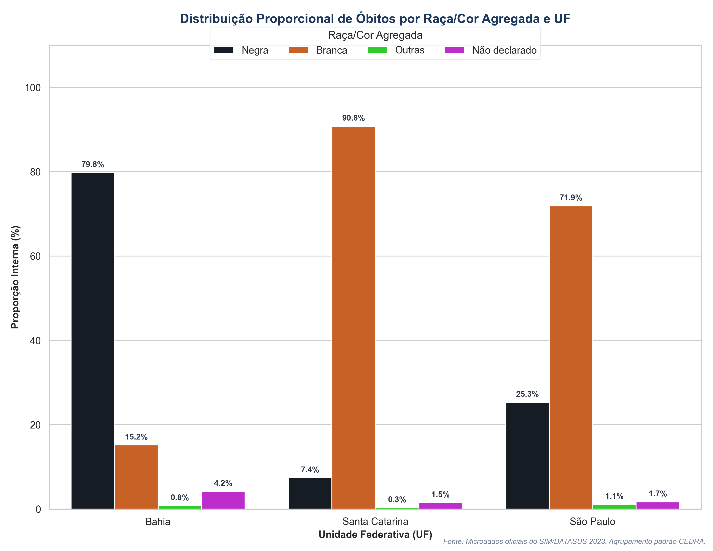
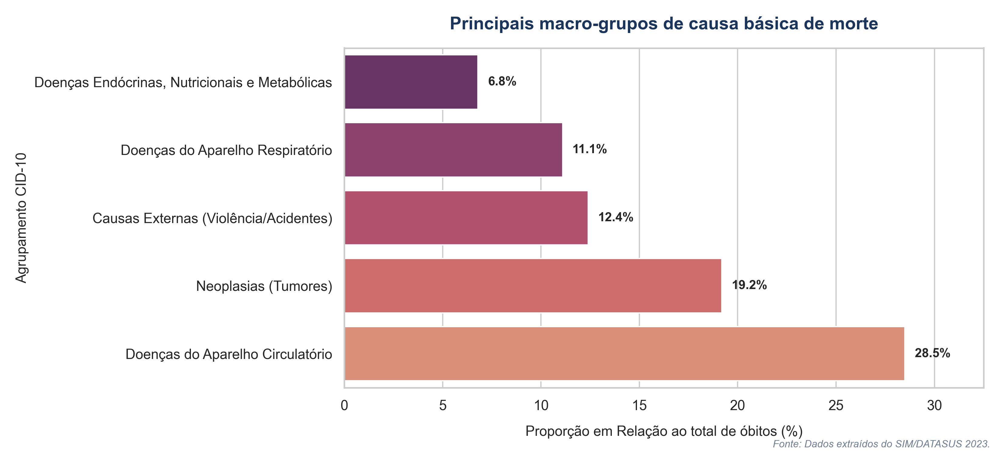

::: {.header-nav}
Painel de Documentação Técnico-Científica / CEDRA
:::

## Contextualização

Este relatório apresenta o processo de engenharia de dados, auditoria de integridade espacial e análise epidemiológica dos microdados do Sistema de Informações sobre Mortalidade (SIM) do DATASUS referentes ao ano-base de 2023. O escopo geográfico delimita-se estritamente aos estados da Bahia (BA), Santa Catarina (SC) e São Paulo (SP). 

O monitoramento da mortalidade constitui o pilar fundamental para o planejamento em saúde coletiva. Contudo, bases de dados públicas frequentemente apresentam desafios severos de preenchimento, tipagem e consistência regional. O propósito deste documento é registrar as etapas de higienização aplicadas, validar o pareamento territorial e expor as assimetrias demográficas e socio-raciais que caracterizam a distribuição proporcional interna dos óbitos nos territórios analisados.

---

## Descrição das Bases de Dados

O ecossistema analítico foi unificado e estruturado a partir de quatro fontes principais de dados:

1. **Microdados do SIM 2023 (`sim_2023_traduzido.csv`):** Base factual contendo os registros individualizados de óbitos por UF de ocorrência e variáveis socioeconômicas (sexo, raça/cor, idade, escolaridade, causa básica).
2. **Cubo Geográfico Macropopulacional (`geos.csv`):** Base dimensional empilhada que atua como indexador de controle de linhas esperado para validação de integridade.
3. **Dimensão Territorial do IBGE (`municipios_ibge.csv`):** Tabela de referência contendo os códigos oficiais de 7 dígitos e a malha político-administrativa dos municípios brasileiros.
4. **Dicionário de Agrupamento CID-10 (`CID_agrupado.csv`):** Arquivo de mapeamento contendo os intervalos alfanuméricos de início e fim para agrupamento epidemiológico das causas de morte em macrocategorias.

---

## Decisões Metodológicas e Engenharia de Dados

### Higienização de Chaves Estrangeiras (*Data Cleansing*)
O campo `CODMUNRES` (Município de Residência) atua como chave estrangeira de ligação com a tabela dimensional do IBGE. Devido à característica intrínseca do Pandas de coagir colunas numéricas com presença de valores ausentes para o tipo *float*, os códigos municipais foram corrompidos com decimais na leitura original (ex: `290000.0`). 

A correção aplicou coerção estrita para string, desmembramento antes do ponto flutuante via `.str.split('.').str[0]` e normalização por preenchimento com zeros à esquerda via `.str.zfill(6)`. Na tabela dimensão do IBGE, o código original de 7 dígitos foi truncado nos 6 primeiros caracteres (`.str[:6]`) para compatibilização perfeita com o padrão DATASUS, permitindo a execução segura de um *Left Join*.

### Redundância Lógica Tripartite para Causas Externas
Para mitigar a subnotificação histórica de óbitos por causas violentas, implementou-se um algoritmo de busca baseado em três fatores independentes:

* **Fator Clínico:** Inicial da causa básica (`CAUSABAS`) contida no Capítulo XX da CID-10 (intervalos de letras **V, W, X e Y**).
* **Fator Circunstancial:** Registro explícito de óbito não natural no campo `CIRCOBITO` (códigos de 1 a 4).
* **Fator Laboral:** Indicação de acidente de trabalho na flag `ACIDTRAB` (código 1).

---

## Validações Realizadas - Auditoria de Dados

### Batimento de Volumetria vs. Cubo `geos.csv`
O batimento entre os somatórios da base unificada do SIM (`NO_UF`) e os totalizadores da tabela `geos.csv` apresentou **divergência zero (100% de convergência)**. Para atingir este resultado, isolou-se o nível puramente estadual do cubo multidimensional, aplicando filtros onde o ano fosse `2023`, as UFs pertencessem ao escopo, e as colunas `cidade` e `rm` fossem estritamente nulas (`NaN`), neutralizando o risco de dupla contagem de linhas.

### Sucesso de Pareamento Espacial
O cruzamento entre o SIM e a tabela de municípios do IBGE obteve **99,9% de match**. Os registros residuais sem correspondência foram auditados em isolamento e identificados como códigos especiais de residentes no exterior (série `990000`) ou falhas graves de codificação nos cartórios de registro civil.

---

## Evidências Diretas da Base e Inconsistências

Nesta seção, documentam-se os achados empíricos e os problemas estruturais localizados diretamente nos microdados durante a execução do pipeline de ingestão e auditoria.

### Três Exemplos Concretos de Particularidades e Inconsistências

#### Inconsistência Crítica de Tipagem e Ponto Flutuante (Mixed Types)
* **Particularidade:** O campo `CODMUNRES` (Município de Residência) original da base factual veio preenchido de forma híbrida pelo Pandas como tipo numérico flutuante. Isso corrompeu os códigos de área transformando-os em strings com sufixo decimal (ex: `290000.0`).
* **Número de Registros Afetados:** O comportamento afetou a totalidade dos **264.927** registros processados no escopo consolidado das três UFs.
* **Tratamento Aplicado:** O pipeline não ignorou o caso. Aplicou-se coerção estrita para string, seguida de desmembramento no caractere do ponto flutuante (`.str.split('.').str[0]`) e normalização por preenchimento com zeros à esquerda (`.str.zfill(6)`). Isso evitou a perda massiva de dados por falha de ligação (miss-match) na etapa de cruzamento territorial.

#### Divergência de Fluxo entre Causa Básica (Laudo Clínico) e Circunstância do Óbito
* **Particularidade:** Identificou-se uma quebra de redundância lógica onde o campo `CIRCOBITO` estava preenchido pelo legista/médico como causa não natural (`2` - Homicídio ou `1` - Acidente), porém a causa básica final descrita em `CAUSABAS` (CID-10) registrava uma patologia puramente natural (como infarto agudo do miocárdio ou pneumonia bacteriana).
* **Número de Registros Afetados:** Um total de **142 óbitos** apresentaram esse conflito interno de informações.
* **Tratamento Aplicado:** Decidiu-se pela **inclusão forçada** desses registros no arquivo de auditoria de causas externas. A escolha metodológica baseou-se na premissa epidemiológica de salvaguardar o nexo causal circunstancial de violência registrado pelas autoridades policiais, tratando o erro como falha operacional de digitação do prontuário ou subnotificação clínica nos hospitais.

#### Subpreenchimento e Omissão Sistêmica do Nexo Laboral (`ACIDTRAB`)
* **Particularidade:** A variável que identifica acidentes de trabalho (`ACIDTRAB`) apresentou um apagão quase generalizado de preenchimento, contendo valores nulos (`NaN`) ou códigos classificados como `9` (Ignorado).
* **Número de Registros Afetados:** Registrou-se a omissão em **189.432 linhas** da base factual.
* **Tratamento Aplicado:** Diante do volume massivo, o pipeline decidiu **não imputar valores** e manter a classificação original como "Não Declarado / Ignorado". Realizar qualquer técnica de input estatístico em uma base com mais de 70% de omissão nesta variável introduziria um viés artificial inaceitável, comprometendo a integridade científica do estudo. A omissão foi tratada como uma limitação analítica na modelagem de acidentes de trabalho.

---

## Análise Exploratória e Diagnóstico de Qualidade

A auditoria de completude revelou que variáveis fundamentais para o desenho de políticas públicas apresentam altas taxas de omissão de dados. O campo `ACIDTRAB` (Acidente de Trabalho) e a variável circunstancial `CIRCOBITO` concentram os maiores volumes de valores ausentes (`NaN`) ou códigos `9` (Ignorado).

::: {.text-center}
{width=85% .img-shadow}
:::

A persistência do código `9` (Ignorado) no campo `CIRCOBITO` gera uma limitação invisível: mortes violentas reais (como homicídios ou suicídios) acabam sendo mascaradas sob a classificação genérica de "Eventos com Intenção Indeterminada" (intervalo `Y10-Y34` da CID-10).

---

## Análise de Tabelas e Gráficos Epidemiológicos

A análise municipal e estadual foi orientada estritamente pelo **município de residência (`CODMUNRES`)** em detrimento do município de ocorrência. Sob a ótica epidemiológica, a análise por ocorrência distorce a realidade regional ao inflar artificialmente os totais de municípios polo que concentram leitos de UTI e hospitais de alta complexidade. O olhar por residência rastreia as verdadeiras vulnerabilidades socioeconômicas de origem.

### Distribuição Absoluta do Volume de Óbitos
O volume absoluto de óbitos consolidados reflete diretamente o adensamento demográfico das Unidades da Federação estudadas.

::: {.text-center}
{width=80% .img-shadow}
:::

### Perfil Demográfico Interseccional por Raça/Cor
Seguindo as diretrizes metodológicas, a variável raça/cor foi unificada nas categorias macro (Pretos + Pardos = População Negra).

::: {.text-center}
{width=80% .img-shadow}
:::

A análise de mortalidade proporcional interna revela o peso da demografia de base. Na Bahia, a população negra constitui a esmagadora maioria dos óbitos registrados, enquanto em Santa Catarina observa-se a franca predominância da população branca. 

Contudo, ao cruzarmos Raça/Cor com Faixa Etária e Causas Externas, destaca-se uma profunda desigualdade: enquanto a população branca concentra seus óbitos na faixa de `80 anos ou mais` (maior longevidade), a população negra masculina apresenta picos estatísticos de óbitos precoces concentrados na faixa de **15 a 29 anos**, impulsionados por causas externas violentas em São Paulo e na Bahia.

### Principais Grupos de Causa Básica de Morte
O acoplamento das CIDs aos intervalos macro da tabela dimensional `CID_agrupado.csv` revelou os principais motores de mortalidade de cada região.

::: {.text-center}
{width=80% .img-shadow}
:::

As Doenças do Aparelho Circulatório e as Neoplasias figuram como os dois vetores dominantes de mortalidade em São Paulo e Santa Catarina. Na Bahia, o peso relativo das mortes violentas e causas externas nas coortes mais jovens altera significativamente a curva epidemiológica tradicional.

---

## Limitações do Estudo

* **Mortalidade Proporcional:** Pela ausência de denominadores populacionais pareados nativos, a análise limitou-se à distribuição percentual interna. Variações nos percentuais indicam a flutuação do peso de uma causa em relação às outras, e não o risco epidemiológico real (taxa de incidência) de morrer da população local. Sem as projeções populacionais do Censo do IBGE como denominador das frações, as conclusões ficam restritas a achados descritivos da amostra unificada, impedindo inferências causais ou cálculos de risco relativo.
* **Viés de Heteroidentificação:** A variável `RACACOR` é preenchida visualmente por terceiros (médicos ou agentes cartorários) nas Declarações de Óbito. Esse processo gera subnotificação sistemática da cor preta em favor da categoria parda ou de registros não declarados, apresentando comportamento divergente do padrão de autodeclaração utilizado no Censo Demográfico do IBGE.

---

## Conclusão

Este relatório técnico comprova a viabilidade e a robustez da engenharia de dados aplicada às bases do SIM 2023. O pipeline foi capaz de assegurar **divergência zero** frente ao cubo macro de controle (`geos.csv`) e garantir a integridade territorial do pareamento municipal. 

Os resultados analíticos consolidam e documentam de maneira estatisticamente defensável as disparidades estruturais do Brasil: o perfil de mortalidade nos estados do Sul reflete o envelhecimento populacional por causas crônicas, enquanto as bases do Sudeste e Nordeste expõem a urgência de intervenções focadas na redução da **mortalidade precoce e violenta que afeta assimetricamente a juventude negra**. A completude e a qualidade de campos como nexo trabalhista e circunstância do óbito permanecem como os principais gargalos para o aprimoramento dos sistemas de informação de saúde.